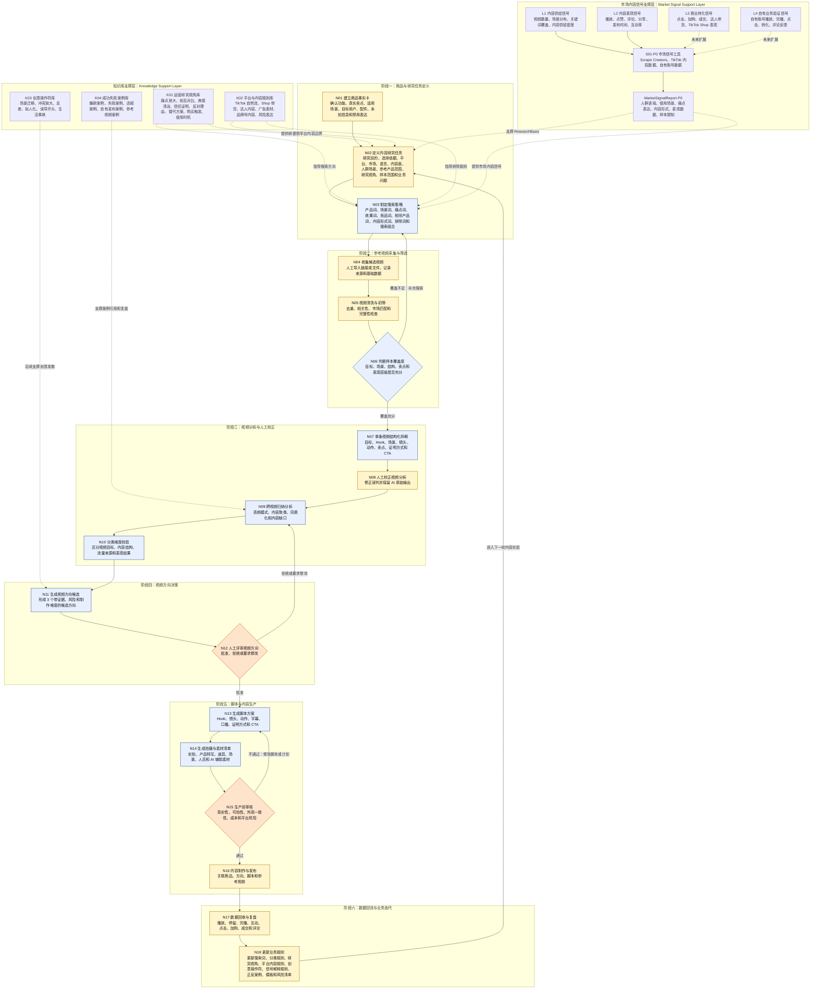

## 知识库支撑层说明

1. K01-K04 是知识库支撑层，不是 N01—N18 主流程节点。
2. SIG-P0 / MarketSignalReport P0 是市场信号支撑层，不是 N01—N18 主流程节点。
3. K01/K02 当前主要支撑 N02/N03。
4. K03 当前主要支撑后续 N11 视频方向候选和 N13 脚本生成。
5. K04 当前主要支撑 N07/N09 分析、N11 方向生成和 N18 规则更新。
6. SIG-P0 可以与 N02A 并行开发，但必须保持模块隔离。
7. N02A 通过 ResearchBasis 引用 Knowledge refs 和 MarketSignalReport refs。
8. N02A 不调用 Scrape Creators，不做统计分析，不做自动推荐。
9. Scrape Creators 等公开视频数据主要支持 L1/L2，不能单独证明真实购买人群或真实转化率。
10. N18 负责将复盘结果、市场信号解释规则、案例和风险清单受控回流到业务知识库。

## 关键业务不变量

1. 未经人工确认的商品事实不得作为视频卖点或脚本依据。
2. 未通过 N08 人工校正的视频分析，不得进入正式跨视频归纳。
3. N07、N09 和 N11 的关键结论必须回指原视频、时间点、字幕、画面或视频编号。
4. “引流、种草、转化、养号”属于视频目标。
5. “演示、痛点、对比、教程”等属于内容结构。
6. “爆款”属于表现结果，不得作为内容类型。
7. 未通过 N12 人工批准的方向，不得进入 N13。
8. 未通过 N15 生产前审核的内容，不得进入 N16。
9. N18 的正式业务规则更新必须人工批准，系统不得根据模型输出自动修改规则。
10. 所有人工修订必须保留 AI 原始输出和修订记录。
