```mermaid
flowchart TD

    subgraph S1["阶段一：商品与研究任务定义"]
        N01["N01 建立商品事实卡<br/>确认功能、卖点、场景、配件和禁用表达"]
        N02["N02 定义研究任务<br/>平台、市场、样本范围和业务问题"]
        N03["N03 制定搜索策略<br/>产品词、场景词、痛点词、效果词和内容形式词"]

        N01 --> N02 --> N03
    end

    subgraph S2["阶段二：参考视频采集与筛选"]
        N04["N04 收集候选视频<br/>人工导入链接或文件，记录来源和基础数据"]
        N05["N05 视频清洗与初筛<br/>去重、相关性、市场匹配和完整性检查"]
        N06{"N06 判断样本覆盖度<br/>目标、场景、结构、卖点和表现层级是否充分"}

        N03 --> N04 --> N05 --> N06
        N06 -- "覆盖不足：补充搜索" --> N03
    end

    subgraph S3["阶段三：视频分析与人工校正"]
        N07["N07 单条视频结构化拆解<br/>目标、Hook、场景、镜头、动作、卖点、证明方式和 CTA"]
        N08["N08 人工校正视频分析<br/>修正误判并保留 AI 原始输出"]
        N09["N09 跨视频归纳分析<br/>高频模式、内容聚类、同质化和内容缺口"]
        N10["N10 分类维度校验<br/>区分视频目标、内容结构、流量来源和表现结果"]

        N06 -- "覆盖充分" --> N07
        N07 --> N08 --> N09 --> N10
    end

    subgraph S4["阶段四：视频方向决策"]
        N11["N11 生成视频方向候选<br/>形成 3 个带证据、风险和制作难度的候选方向"]
        N12{"N12 人工评审视频方向<br/>批准、拒绝或要求修改"}

        N10 --> N11 --> N12
        N12 -- "拒绝或要求修改" --> N09
    end

    subgraph S5["阶段五：脚本与内容生产"]
        N13["N13 生成脚本方案<br/>Hook、镜头、动作、字幕、口播、证明方式和 CTA"]
        N14["N14 生成拍摄与素材清单<br/>实拍、产品特写、道具、场景、人员和 AI 辅助素材"]
        N15{"N15 生产前审核<br/>真实性、可拍性、外观一致性、成本和平台风险"}
        N16["N16 内容制作与发布<br/>关联商品、方向、脚本和参考视频"]

        N12 -- "批准" --> N13
        N13 --> N14 --> N15
        N15 -- "不通过：修改脚本或计划" --> N13
        N15 -- "通过" --> N16
    end

    subgraph S6["阶段六：数据回流与业务迭代"]
        N17["N17 数据回收与复盘<br/>播放、停留、完播、互动、点击、加购、成交和评论"]
        N18["N18 更新业务规则<br/>更新搜索词、分类规则、正反案例、模板和风险清单"]

        N16 --> N17 --> N18
        N18 -- "进入下一轮内容实验" --> N02
    end

    classDef ai fill:#E8F0FF,stroke:#4169A1,stroke-width:1.5px,color:#111;
    classDef human fill:#FFF4CC,stroke:#B88A16,stroke-width:1.5px,color:#111;
    classDef decision fill:#FFE4CC,stroke:#C56A18,stroke-width:1.5px,color:#111;
    classDef output fill:#E5F5E9,stroke:#3F8A54,stroke-width:1.5px,color:#111;

    class N03,N06,N07,N09,N10,N11,N13,N14 ai;
    class N01,N02,N04,N05,N08,N16,N17,N18 human;
    class N12,N15 decision;
    
```

## 关键业务不变量

1. 未经人工确认的商品事实不得作为视频卖点或脚本依据。
2. 未通过 N08 人工校正的视频分析，不得进入正式跨视频归纳。
3. N07、N09 和 N11 的关键结论必须回指原视频、时间点、字幕、画面或视频编号。
4. “引流、种草、转化、养号”属于视频目标。
5. “演示、痛点、对比、教程”等属于内容结构。
6. “爆款”属于表现结果，不得作为内容类型。
7. 未通过 N12 人工批准的方向，不得进入 N13。
8. 未通过 N15 生产前审核的内容，不得进入 N16。
9. N18 的正式业务规则更新必须人工批准，系统不得根据模型输出自动修改规则。
10. 所有人工修订必须保留 AI 原始输出和修订记录。
