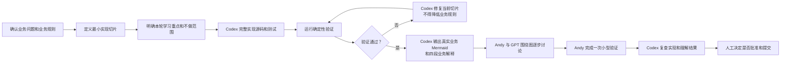
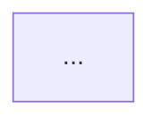
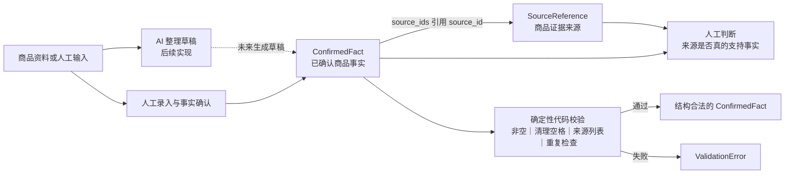

# Guided Implementation Plan

- Version: V0.3
- Status: Approved Development Method
- Method: Visual Review-Driven Implementation
- Scope: Teaching-oriented implementation workflow

V0.3 将学习审查重点进一步从代码问题和手写实现，调整为业务对象、数据关系、责任边界和系统能力边界的可视化审查。

本文件定义 Video Direction Workbench 的教学型开发方法、角色分工、单轮开发流程和当前阶段的实现顺序。

本文件不是业务事实源，不重新定义业务。

业务流程仍以：

- `docs/00_BUSINESS_FLOW.md`

为准。

节点输入、处理、输出、决策权和验收标准仍以：

- `docs/01_NODE_CONTRACTS.md`

为准。

当本文件与两个业务事实源冲突时，以业务事实源为依据，并停止相关实现等待人工确认。

## 1. Development Mode

项目采用以下开发方式：

- Business-driven development
- Visual review-driven implementation
- Human-in-the-loop technical review
- Incremental delivery

核心原则：

1. Codex 完整实现当前批准的最小业务切片。
2. 实现必须可运行、可测试，不得故意留下半成品。
3. Codex 负责主要源码、测试和机械样板。
4. Codex 必须绘制当前真实业务逻辑 Mermaid，并提供四段业务逻辑解释。
5. Andy 负责确认业务规则、理解对象关系、判断责任边界和批准实现。
6. GPT 帮助 Andy 围绕 Mermaid 分析系统逻辑、数据关系和业务风险。
7. 每轮只实现一个最小切片。
8. 每轮必须有明确的不做范围。
9. 不提前实现后续节点。
10. 不以代码行数衡量学习效果。
11. 不以测试全绿作为唯一完成标准。

开发循环：

```text
业务规则确认
→ Codex 完整实现
→ 自动测试
→ 真实业务 Mermaid
→ 四段业务逻辑解释
→ GPT 辅助讨论
→ Andy 小型验证
→ Codex 复查
→ 人工批准
```

## 2. Role Responsibilities

| 工作内容 | Codex 责任 | Andy 责任 |
|---|---|---|
| 业务规则 | 根据事实源实现，不得擅自修改 | 最终确认 |
| 文件与目录创建 | 创建本轮必要内容 | 审查范围 |
| 业务源码 | 完整实现最小切片 | 理解关键路径 |
| 重复样板 | 完成 | 不必手写 |
| 确定性校验 | 完整实现并测试 | 解释规则和风险 |
| 测试编写 | 完整基础测试 | 阅读关键测试并完成一次验证 |
| 业务逻辑 Mermaid | 绘制真实对象、字段、关系、状态和边界 | 围绕图审查业务逻辑 |
| 四段业务解释 | 解释对象、关系、责任和能力边界 | 判断解释是否符合业务 |
| 关键代码定位 | 提供文件、符号和职责 | 必要时下钻代码 |
| 小型动手任务 | 设计一个有限任务 | 亲自完成或明确判断 |
| 代码审查 | 根据 Andy 的反馈复查 | 决定是否接受 |
| Git 提交 | 不自动执行 | 人工批准 |

Andy 不需要机械手写 imports、导出、重复 validator、CRUD 样板和测试数据构造。

Andy 必须理解和批准：

- 领域模型。
- 关键 Schema。
- 跨对象引用。
- 状态和人工闸门。
- LLM 输入输出契约。
- 确定性校验。
- 关键测试。
- 错误和回退路径。

基础阶段不要求 Andy 机械手写主要业务代码。

Stage 1（N01—N03）基础阶段默认分工：

Codex 负责：

1. 完整实现当前批准的最小业务切片。
2. 编写必要测试。
3. 运行确定性验证。
4. 绘制真实业务 Mermaid。
5. 编写四段业务逻辑解释。
6. 标出关键代码位置。
7. 设计一个有限的最小验证任务。
8. 根据 Andy 的问题进行代码复查。

Andy 负责：

1. 确认业务规则。
2. 理解新增业务对象。
3. 理解对象之间的数据关系。
4. 判断代码、AI、人工的责任边界。
5. 判断系统当前能保证和不能保证什么。
6. 与 GPT 围绕 Mermaid 逐步讨论。
7. 完成一个最小验证。
8. 决定是否批准和提交。

GPT 负责：

1. 根据 Mermaid 解释系统逻辑。
2. 一次只讨论一个关系或边界。
3. 不用大量语法问题打断业务理解。
4. 仅在必要时下钻到关键代码。
5. 帮助 Andy 判断 Codex 是否错误实现业务规则。

## 3. Code Skeleton Standard

Codex 默认交付完整可运行代码。

正式代码中不得为了教学故意留下：

- `pass`
- `NotImplementedError`
- 无实现 TODO
- 被跳过的关键测试

TODO 只允许用于：

- 明确尚未进入当前范围的未来任务。
- Andy 明确要求亲手完成的单个新概念。

学习问题应放在 Codex 的切片完成报告中，不应污染生产代码。

注释解释业务原因和约束，不逐行翻译语法。

Codex 不得用过度注释制造“看起来在教学”的噪声。

合理注释示例：

```python
# 标准化值只用于确定性重复判断。
# 原始人工确认文本必须保留，不能被标准化结果覆盖。
normalized = normalize_statement(statement)
```

## 4. Iteration Workflow



每轮固定步骤：

1. 明确业务目标。
2. 明确业务规则。
3. 明确本轮实现范围。
4. 明确本轮不做什么。
5. 明确需要重点理解的概念。
6. Codex 完整实现。
7. Codex 完成正常测试和失败测试。
8. Codex 运行确定性验证。
9. Codex 输出 Visual Business Logic Review。
10. Andy 与 GPT 围绕 Mermaid 逐步讨论。
11. Andy 完成一次小型验证。
12. Codex 复查。
13. 人工批准后提交。
14. 未批准不得进入下一切片。

## 5. Visual Business Logic Review

每个最小业务切片完成后，Codex 必须输出一个 Visual Business Logic Review。

必须包含：

1. 一张或最多两张 Mermaid。
2. 四段简明解释。
3. 关键代码定位。
4. 一个最小验证任务。
5. 当前剩余风险。

### 5.1 Mermaid Requirements

每个切片必须绘制当前真实业务逻辑 Mermaid。

Mermaid 不能只是抽象模板，例如：

```text
输入 → 处理 → 输出
```

也不能只画问题列表。

Mermaid 必须使用当前真实的：

- 业务对象名。
- 字段名。
- 状态名。
- 引用关系。
- 责任主体。
- 校验结果。
- 错误路径。

例如可以出现：

- `SourceReference`
- `ConfirmedFact`
- `source_id`
- `source_ids`
- `ProductBrief`
- `ValidationError`
- `AI draft`
- `Human approval`

Mermaid 至少要表现：

1. 数据从哪里进入系统？
2. 新对象是什么？
3. 新对象与已有对象如何连接？
4. 确定性代码在哪里校验？
5. AI 在哪里可能参与？
6. 人工在哪里判断或批准？
7. 成功结果是什么？
8. 失败结果是什么？
9. 当前未覆盖的边界是什么？

如果一张图过于拥挤，可以拆成最多两张：

1. 对象与数据关系图。
2. 代码、AI、人工责任边界图。

不得为了视觉效果增加不存在的业务对象。

### 5.2 Four Core Explanations

每个业务切片必须在 Mermaid 后回答以下四个问题。

1. 新增了什么业务对象？

必须说明本轮新增了哪些类、模型、状态或产物，每个对象在业务中代表什么，以及为什么需要单独存在。不要只重复类名。

2. 它和已有对象是什么关系？

必须说明谁引用谁、谁包含谁、谁产生谁、谁依赖谁、一对一、一对多或多对多关系，以及数据如何从前一个对象进入下一个对象。

必须使用真实字段名解释关系，例如：

```text
ConfirmedFact 通过 source_ids 引用 SourceReference 的 source_id。
```

3. 代码、AI、人工分别负责什么？

必须明确区分：

- 确定性代码负责类型、格式、唯一性、引用完整性、状态限制、可重复验证的业务规则。
- AI 负责提取、整理、分类建议、草稿生成、非确定性分析。
- 人工负责确认商品事实、判断证据是否有效、修改错误结果、批准方向或状态、对业务结果负责。

不得把三者职责混在一起。

4. 当前系统能保证什么，不能保证什么？

必须分成：

```text
当前能保证：
当前不能保证：
```

“能保证”必须来自真实代码和测试。

“不能保证”必须指出当前边界，例如：

- 结构正确但内容可能是假的。
- ID 格式正确但引用对象可能不存在。
- 来源存在但未必能证明事实。
- AI 输出符合 Schema 但业务判断可能错误。
- 测试覆盖局部规则但未覆盖真实业务表现。

不得使用“基本正确”“大概率正确”等模糊表达。

### 5.3 Fixed Output Template

```text
Visual Business Logic Review

A. Business Logic Mermaid
```



```text
B. Four Core Explanations

1. 新增了什么业务对象？
简明解释。

2. 它和已有对象是什么关系？
简明解释。

3. 代码、AI、人工分别负责什么？
简明解释。

4. 当前系统能保证什么，不能保证什么？
简明解释。

C. Key Code Pointers
只列文件路径、类名、函数名、测试名和一句话职责。
不得以绝对行号作为唯一定位方式。

D. One Minimal Verification
只保留一个最小验证任务。

E. Remaining Boundary
只列后续切片才会处理的真实边界。
```

### 5.4 N01A-1 Example

以下示例只用于说明以后应该如何输出，不要求重做 N01A-1。



配套四段解释：

1. 新增 `SourceReference` 和 `ConfirmedFact`。`SourceReference` 表示商品证据来源，`ConfirmedFact` 表示已确认且允许进入后续流程的商品事实。
2. `ConfirmedFact` 通过 `source_ids` 引用 `SourceReference.source_id`。一条事实可以引用多个来源。
3. 代码检查结构和局部规则，AI 未来只生成草稿，人工判断事实真实性和证据是否有效。
4. 当前能保证局部结构合法；当前不能保证来源真实存在，或来源真的支持事实。

### 5.5 Discussion Rules

新的讨论规则：

1. Codex 先完整提供 Mermaid 和四段初始解释。
2. Andy 不需要从空白回答整套问题。
3. Andy 与 GPT 根据图逐步讨论。
4. 每次只讨论一个对象、一条关系、一个责任边界或一个能力边界。
5. 只有业务逻辑不清楚时才下钻代码。
6. 不得一次抛出十几个问题。
7. 不得要求 Andy 背字段名或机械复述代码。
8. 学习目标是能解释系统关系，而不是背框架语法。

### 5.6 One Minimal Verification

每轮只要求一个有限的实际任务，可从以下选择：

- 增加一个失败测试。
- 修改一条局部业务规则并同步测试。
- 定位一个人为制造的 bug。
- 预测一组输入并运行验证。
- 阅读并批准一个关键 diff。
- 为一个剩余风险补测试。

任务必须：

- 控制在当前切片内。
- 不要求重写整个模块。
- 不引入后续节点。
- 能验证 Andy 确实理解业务对象、数据关系或边界。

## 6. Error And Discussion Policy

1. Codex 对自己完整实现的代码负责，测试失败时应修复。
2. 不得通过删除测试、降低规则或吞掉异常让测试通过。
3. Andy 在完成小型验证时遇到问题，可以先与 GPT 讨论。
4. GPT 应优先解释错误类型、数据流、业务规则和相关代码位置。
5. Andy 可以决定自己修改，或要求 Codex 提供最小补丁。
6. Codex 提供补丁时必须说明根因、修改内容、为什么符合业务契约，以及哪个测试证明修复有效。

## 7. Definition Of Done

每个教学切片必须同时满足：

- 本轮业务目标完成。
- Codex 已交付完整可运行代码。
- 正常输入测试通过。
- 错误输入被正确拒绝。
- 没有遗留无意义 TODO 或 `NotImplementedError`。
- 没有实现超出当前范围的功能。
- Codex 已输出真实业务 Mermaid。
- Codex 已输出四段业务逻辑解释。
- Mermaid 与代码和业务文档一致。
- Andy 能根据图解释核心数据关系。
- Andy 能区分代码、AI、人工职责。
- Andy 能指出至少一个当前不能保证的边界。
- Andy 完成一次小型验证。
- Codex 已完成复查。
- 人工明确批准。
- Git 提交未由 Codex 擅自执行。
- 未提前实现下一切片。

不再要求：

- Andy 每轮必须从零手写主要业务源码。
- Andy 每轮必须独立编写一个正常测试和一个失败测试。
- 以亲手代码行数作为完成标准。
- Andy 回答大量代码问题。
- Andy 背诵框架语法。

## 8. Current Implementation Roadmap

只规划当前近期阶段，不详细规划 N04—N18。

```text
Stage 0：业务定义与项目骨架
状态：完成

Stage 1：商品事实与研究输入
范围：
- N01 ProductBrief
- N02 ResearchTask
- N03 SearchPlan

当前真实状态：
- N01A ProductBrief 已完成
- 当前允许并行准备和实现三条线：
  - Track A: N02A ResearchTask Domain Contract
  - Track B: K-P0 Knowledge Catalog
  - Track C: SIG-P0 Market Signal Tool
- 三条线必须分别评审、分别测试、分别提交
- N02A 不得实现 K-P0/SIG-P0/N03
- K-P0 不得修改 N02A 代码
- SIG-P0 不得自动修改 ResearchTask
```

### N01A-1：基础领域模型

业务输出：

- `SourceType`
- `FactCategory`
- `SourceReference`
- `ConfirmedFact`

过渡说明：

```text
N01A-1 已按 V0.1 模式启动，Andy 已亲自实现部分 validator。
已有代码保留，不进行重写。

N01A-1 收尾完成后，从 N01A-2 开始默认采用 V0.3
Visual Review-Driven Implementation。
```

不得要求重做 N01A-1。

明确本切片不得实现：

- `ProductBrief`。
- 跨对象引用校验。
- AI。
- JSON 保存。
- N02。

### N01A-2：商品事实状态分类

业务输出：

- `UnknownItem`
- `ProhibitedClaim`

学习重点：

- 为什么“已确认”“未知”“禁止声称”必须是不同对象。
- 默认值。
- 列表字段。
- 不同业务状态的表达。

Codex：

- 完整实现当前最小切片。
- 编写测试。
- 运行验证。
- 输出 Visual Business Logic Review。

Andy：

- 确认业务规则。
- 理解业务 Mermaid 和四段解释。
- 与 GPT 围绕 Mermaid 讨论对象、关系和边界。
- 完成一个小型验证。
- 决定是否批准。

### N01A-3：ProductBrief 聚合与跨对象校验

业务输出：

- `ProductBrief`

学习内容：

- model validator。
- ID 唯一性。
- source 引用完整性。
- 跨字段冲突。
- 文本标准化。
- 确定性业务规则。

Codex：

- 完整实现当前最小切片。
- 编写测试。
- 运行验证。
- 输出 Visual Business Logic Review。

Andy：

- 确认业务规则。
- 理解业务 Mermaid 和四段解释。
- 与 GPT 围绕 Mermaid 讨论对象、关系和边界。
- 完成一个小型验证。
- 决定是否批准。

### N01A-4：真实车载吸尘器样例

业务输出：

```text
sample_data/products/car_vacuum_yd_592c.product_brief.json
```

要求：

- 商品事实必须来自人工确认资料。
- AI 只能协助转换格式。
- Andy 完成一个小型验证，例如制造一次无效引用并观察验证失败。
- 修复后重新验证。
- 导出 JSON Schema。

Codex：

- 完整实现当前最小切片。
- 编写测试。
- 运行验证。
- 输出 Visual Business Logic Review。

Andy：

- 确认业务规则。
- 理解业务 Mermaid 和四段解释。
- 与 GPT 围绕 Mermaid 讨论对象、关系和边界。
- 完成一个小型验证。
- 决定是否批准。

### N02A ResearchTask Domain Contract

当前切片目标：

N02A 只实现 `ResearchTask` Domain Contract。它用于在 `ProductBrief` 商品事实边界下，由人工定义一轮 TikTok 内容研究任务。

N02A 应包含的业务对象：

- `ProductBriefReference`
- `ResearchBasis`
- `ResearchIntent`
- `ResearchScope`
- `AudienceAndScenarioFrame`
- `ContentReferenceFrame`
- `ResearchLensSelection`
- `ResearchQuestion`
- `ExclusionRule`
- `ResearchTask`

对象业务含义：

- `ProductBriefReference`：只保存 `product_id`、`product_name`、`revision`，用于绑定 `ProductBrief` revision。不得复制 `ProductBrief` 的 `sources`、`confirmed_facts`、`unknown_items`、`prohibited_claims`。
- `ResearchBasis`：记录本轮研究任务的选择依据。用于说明为什么选择某些人群、场景、痛点、参考产品范围、研究视角和研究问题。当前可以由人工判断、默认假设或 MarketSignalReport P0 引用填写。当前 N02A 不实现数据采集、统计分析或自动推荐。字段包括 `basis_type`、`summary`、`knowledge_refs`、`supporting_signal_refs`、`limitations`。
- `ResearchIntent`：说明本轮研究服务什么业务动作，例如 `reference_video_search`、`content_direction_discovery`、`hook_and_scene_discovery`。
- `ResearchScope`：定义 `platform`、`content_surface`、`market`、`language`、`time_window`、`target_sample_count`。
- `AudienceAndScenarioFrame`：定义 `primary_audience`、`secondary_audiences`、`use_scenarios`、`pain_points`。它表达本轮研究观察的人群与场景假设，不是已验证目标用户结论，也不是购买人群统计结果。如果有 MarketSignalReport P0 支撑，应通过 `ResearchBasis.supporting_signal_refs` 引用，不得复制完整报告内容。
- `ContentReferenceFrame`：定义 `direct_reference_products`、`adjacent_reference_products`、`reference_video_types`。
- `ResearchLensSelection`：定义本轮选择哪些运营研究视角，例如 `problem_amplification`、`before_after_transformation`、`satisfying_cleaning`、`trust_through_demonstration`。当前只作为任务字段，不实现知识库查询或管理。
- `ResearchQuestion`：定义本轮研究要回答的内容问题。
- `ExclusionRule`：定义必须排除的视频、产品类型、表达方式或风险内容。
- `ResearchTask`：聚合以上对象，形成一轮内容研究任务合同。

`ProductBrief` 到 `ResearchTask` 的关系：

- `ProductBrief` 提供商品事实边界。
- 人工提供运营研究意图。
- K-P0 通过 `knowledge_refs` 提供研究视角、平台规则、创意操作符和案例引用口径。
- SIG-P0 通过 MarketSignalReport P0 提供市场内容信号。
- `ResearchBasis` 记录选择依据、知识引用、信号引用和局限性。
- `ResearchTask` 固化本轮内容研究任务。
- `ResearchTask` 可以引用 `ProductBrief`，但不得修改 `ProductBrief`。
- `ResearchTask` 不得复制 `ProductBrief` 的事实、未知项、禁止声称和来源列表。
- `ResearchTask` 不得复制完整知识库条目或完整 MarketSignalReport。
- `ResearchTask` 应绑定 `ProductBrief` 的 `product_id`、`product_name`、`revision`。

创意能力边界：

当前系统未来可以通过研究视角库、创意操作符库、案例库和人工评审提升创意发散能力。

N02A 不实现创意生成。N02A 只记录本轮研究选择了哪些研究视角。

视频方向创意应发生在 N11。脚本创意应发生在 N13。

K03/K04 已纳入架构支撑层；当前 Track A N02A 不实现 K03/K04，Track B K-P0 可以设计其字段和引用格式，后续接入 N11/N13 需另行批准。

## Parallel Development Tracks

当前允许并行推进三条线。

### Track A: N02A ResearchTask Domain Contract

目标：实现 `ResearchTask` 领域合同，用 `ProductBrief` 创建一轮内容研究任务。

允许：

- `ProductBriefReference`
- `ResearchBasis`
- `ResearchIntent`
- `ResearchScope`
- `AudienceAndScenarioFrame`
- `ContentReferenceFrame`
- `ResearchLensSelection`
- `ResearchQuestion`
- `ExclusionRule`
- `ResearchTask`
- 一个真实 `ProductBrief` 到 `ResearchTask` 的最小样例验证

禁止：

- Scrape Creators API
- 市场数据采集
- 统计分析
- 自动推荐
- `SearchPlan`
- 视频抓取
- 视频分析
- 创意方向
- 脚本

### Track B: K-P0 Knowledge Catalog

目标：建立版本化知识库目录和稳定知识 ID，为 N02A、SIG-P0、N03、N11、N13、N18 提供统一标签和解释口径。

覆盖：

- K01 Research Lens Catalog
- K02 Platform & Content Rules Library
- K03 Creative Operator Library
- K04 Success / Failure Case Library

当前允许：

- 设计知识项字段
- 设计 knowledge_ref 格式
- 设计最小 YAML / Markdown 文件结构
- 设计标签体系
- 设计版本规则
- 设计人工批准规则

当前禁止：

- 数据库
- UI
- 自动学习
- 自动覆盖正式知识库
- 自动生成创意脚本
- 替代 ProductBrief 商品事实边界

### Track C: SIG-P0 Market Signal Tool

目标：做一个可以真实服务日常运营的市场内容信号工具，优先支持 Scrape Creators 或其导出数据。

允许：

- 开发者脚本或实验入口
- Scrape Creators API adapter 或导出数据读取器
- raw response 保存
- normalized video signal 输出
- 去重
- 基础字段标准化
- 简单规则分类 audience/scenario/pain_point/content_type
- 基础统计
- MarketSignalReport P0 输出
- limitations 输出

禁止：

- 自动修改 `ResearchTask`
- 自动批准 `primary_audience` / `secondary_audiences` / `selected_lenses`
- 自动生成正式 `SearchPlan`
- 自动生成创意方向或脚本
- 数据库
- 正式 UI
- 正式产品化 CLI
- 将公开视频数据解释为真实购买人群或真实转化结论

## Cross-Track Interface Rules

- K-P0 输出 `knowledge_refs`。
- SIG-P0 输出 `MarketSignalReport P0`。
- N02A 的 `ResearchBasis` 引用 `knowledge_refs` 和 `supporting_signal_refs`。
- N02A 不复制完整知识库内容或完整市场信号报告。
- SIG-P0 可以读取 K-P0 的标签定义，但不得修改 K-P0。
- N18 才负责受控更新 K-P0 和信号解释规则。
- 所有跨轨引用必须包含 version 或 report_id。

## Signal Evidence Boundaries

L1 Content Supply Signals：公开视频数量、关键词覆盖、场景分布、内容供给密度。

L2 Content Performance Signals：播放、点赞、评论、分享、发布时间、互动率、播放速度等。

L3 Commercial Conversion Signals：点击、加购、成交、达人带货、TikTok Shop 商品表现、广告转化。

L4 Own Business Validation Signals：自有账号发布后的播放、停留、完播、点击、加购、成交、评论和复盘判断。

SIG-P0 当前主要覆盖 L1/L2。L3/L4 是未来扩展。不得把相关性解释为因果。

## SIG-P0 Market Signal Smoke Tool Boundary

SIG-P0 最小输入：

- provider
- platform
- market
- language
- time_window
- queries
- limit_per_query

SIG-P0 最小处理：

- 调用 Scrape Creators 或读取导出数据
- 保存 raw JSON
- 标准化视频字段
- 去重
- 粗分类人群语境、使用场景、痛点表达、内容形式
- 计算基础统计
- 输出 MarketSignalReport P0

SIG-P0 最小输出：

- raw data path
- normalized data path
- report_id
- generated_at
- source_queries
- sample_size
- unique_video_count
- scenario_tag_counts
- audience_context_counts
- pain_point_counts
- content_type_counts
- basic_performance_summary
- dirty_sample_notes
- limitations

数据解释边界：

- Scrape Creators 等公开视频数据可以说明内容供给和表现信号。
- 它不能单独证明真实购买人群、真实转化率或某个创意一定成功。
- 指标必须记录时间范围、查询词、样本量、去重方式和偏差说明。
- 不得把统计相关性伪装成因果结论。
- 市场信号报告只能辅助 `ResearchBasis`，不能替代人工决策。

### Track A N02A 当前明确不做

- 不做 N01A 重构。
- 不做 N01B 输入/保存工具。
- 不做 N01C AI 辅助整理。
- 不做前端界面。
- 不做 CLI。
- 不做数据库。
- 不做 AI 生成。
- 不做知识库管理功能。
- 不做 Scrape Creators API。
- 不做 MarketSignalReport 代码。
- 不做市场数据采集。
- 不做统计分析。
- 不做自动推荐。
- 不做 dashboard。
- 不做搜索策略。
- 不抓取视频。
- 不分析视频。
- 不生成创意方向。
- 不生成脚本。
- 不创建 `ResearchResult`。
- 不提前进入 N03。
- 不修改 sample `ProductBrief` 的事实内容。

### SIG-P0 不做

- ProductBrief 重构。
- ResearchTask 自动修改。
- 自动批准研究任务。
- 正式 UI。
- 正式产品化 CLI。
- 数据库。
- SearchPlan 正式生成。
- 视频结构化分析。
- 创意方向。
- 脚本生成。
- 自动更新知识库。

Visual Review-Driven Implementation 要求：

未来实现 N02A 代码时，必须输出：

- 真实业务 Mermaid。
- 四段解释：
  1. 新增了什么业务对象？
  2. 它和已有对象是什么关系？
  3. 代码、AI、人工分别负责什么？
  4. 当前系统能保证什么，不能保证什么？
- 只做一个最小验证。

当前 N02A 最小验证方向：

使用现有真实样例：

```text
sample_data/products/car_vacuum_yd_592c.product_brief.json
```

创建一个 TikTok US 内容研究任务样例，验证：

- `ProductBrief` 能正常加载。
- `ResearchTask` 能从 `ProductBrief` 创建。
- `ProductBriefReference` 的 `product_id`、`product_name`、`revision` 与 `ProductBrief` 一致。
- `ResearchTask` 包含 `ResearchBasis`。
- `ResearchBasis` 可以使用 `basis_type=human_judgement`、`default_assumption`、`market_signal_supported` 或 `mixed`。
- `ResearchBasis.knowledge_refs` 可以引用 K01/K02 中的研究视角和平台规则。
- `ResearchBasis.supporting_signal_refs` 当前可以为空列表，也可以引用一个外部 MarketSignalReport P0 ID。
- `ResearchBasis.limitations` 必须说明当前依据限制。
- `ResearchTask` 包含平台、市场、语言、内容面、人群场景、参考产品范围、研究视角、排除规则和研究问题。
- `AudienceAndScenarioFrame` 被视为研究观察假设，不是已验证购买人群结论。
- 创建 `ResearchTask` 不改变 `ProductBrief` 中 `sources`、`confirmed_facts`、`unknown_items`、`prohibited_claims` 的数量。

注意：这里只写计划，不写代码。

### N01B：人工构建与保存

只写高层目标：

```text
人工输入
→ 确定性校验
→ 保存 JSON
→ 重新加载
```

不得在本文档中提前设计 UI 或数据库。

Codex：

- 完整实现当前最小切片。
- 编写测试。
- 运行验证。
- 输出 Visual Business Logic Review。

Andy：

- 确认业务规则。
- 理解业务 Mermaid 和四段解释。
- 与 GPT 围绕 Mermaid 讨论对象、关系和边界。
- 完成一个小型验证。
- 决定是否批准。

### N01C：AI 辅助整理

只写高层目标：

```text
商品图片或说明文本
→ AI 生成 ProductBrief 草稿
→ Schema 校验
→ 人工确认
→ Approved ProductBrief
```

明确：

- AI 输出只能是草稿。
- 确定性代码负责结构约束。
- 人工负责商品事实批准。
- 未批准结果不得进入 N02。

Codex：

- 完整实现当前最小切片。
- 编写测试。
- 运行验证。
- 输出 Visual Business Logic Review。

Andy：

- 确认业务规则。
- 理解业务 Mermaid 和四段解释。
- 与 GPT 围绕 Mermaid 讨论对象、关系和边界。
- 完成一个小型验证。
- 决定是否批准。

### N02：ResearchTask

目标：在 N01 人工批准后，定义内容研究任务合同，包括研究目的、平台、市场、语言、内容面、人群场景、参考产品范围、研究视角、排除规则和本轮业务问题。

### N03：SearchPlan

目标：基于已批准商品事实和研究任务，形成覆盖产品、场景、痛点、竞品、相邻产品、内容形式、排除词和搜索组合的搜索计划。

## 9. Scope Discipline

禁止：

- 一次实现 N01—N18。
- 一次实现完整 N01。
- 为未来需要预建大量目录。
- 提前加入 LangChain、LangGraph、Agent、RAG。
- 将所有业务逻辑放进 Prompt。
- 用模型代替唯一性、引用完整性等确定性校验。
- 为了测试通过而降低业务标准。
- 创建与真实业务无关的教学 Demo。
- 以代码行数作为学习进度。
- 以测试全绿作为唯一完成标准。
- 完整实现不等于扩大范围。
- Codex 不得提前实现下一个教学切片。
- 不得为了展示能力增加字段、抽象层或框架。
- 不得输出一堆无业务价值的通用代码。
- 不得将学习问题写成生产代码中的大量 TODO。
- 不得用自动生成的解释代替 Andy 的理解审查。
- 不得把学习审查做成大量代码问答或语法考试。
- 不得只画抽象的输入、处理、输出流程图。
