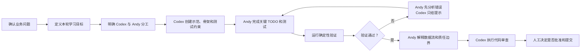

# Guided Implementation Plan

- Version: V0.1
- Status: Approved Development Method
- Scope: Teaching-oriented implementation workflow

本文件定义 Video Direction Workbench 的教学型开发方法、角色分工、单轮开发流程和当前阶段的实现顺序。

本文件不是业务事实源。

业务流程仍以：

- `docs/00_BUSINESS_FLOW.md`

为准。

节点输入、处理、输出、决策权和验收标准仍以：

- `docs/01_NODE_CONTRACTS.md`

为准。

当本文件与两个业务事实源冲突时，以业务事实源为依据，并停止相关实现等待人工确认。

## 1. Development Mode

项目采用以下开发方式：

- Business-driven development
- Guided implementation
- Human-in-the-loop coding
- Incremental delivery

核心原则：

1. 不采用完全留空、让 Andy 从零摸索的方式。
2. 不允许 Codex 一次性完成全部实现。
3. Codex 负责低价值样板、完整示范、测试骨架和提示。
4. Andy 负责关键业务规则、至少部分测试和结果解释。
5. 每轮只完成一个最小教学切片。
6. 每个切片必须可以运行、测试和解释。
7. 不提前实现后续节点。
8. 学习目标服务于真实业务，不独立搭建教学 Demo。

项目采用以下代码教学结构：

```text
一个完整示范
→ 一个带精确 TODO 的共同实现
→ 一个由 Andy 主导完成的实现
→ 测试
→ 解释
→ 代码审查
```

不得采用：

- 整个文件完全留空。
- 只有 `pass` 的无说明空壳。
- Codex 一次性交付全部答案。
- 为教学目的创建与业务无关的练习项目。

## 2. Role Responsibilities

| 工作内容 | Codex 责任 | Andy 责任 |
|---|---|---|
| 文件与目录创建 | 创建本轮必要文件 | 确认范围 |
| 基础配置与 imports | 完成 | 理解用途 |
| 完整示范代码 | 提供一个代表性示例 | 能解释 |
| 重复样板代码 | 可以完成 | 审查 |
| 关键业务规则 | 提供契约和提示 | 亲自实现 |
| 确定性校验 | 提供示范和测试约束 | 至少完成一部分 |
| 测试骨架创建 | 辅助 | 理解 |
| 正常测试 | 辅助 | 每轮至少亲自完成一个 |
| 失败测试 | 辅助 | 每轮至少亲自完成一个 |
| 第一次错误处理 | 只解释和提示 | 先自行修复 |
| 最小修复补丁 | 仅在明确要求后提供 | 理解并决定是否采用 |
| 代码审查 | 负责 | 决定是否接受 |
| Git 提交 | 不自动执行 | 人工批准 |

Codex 不得通过大量无意义 TODO 把所有工作甩给 Andy。Andy 也不需要手写纯重复样板。

学习重点是：

- 业务对象。
- 数据流。
- 状态。
- 关键校验。
- 模型与确定性代码的职责边界。
- 测试如何证明业务规则成立。

## 3. Code Skeleton Standard

教学型代码骨架必须包含：

1. 明确的类或函数签名。
2. 类型标注。
3. 业务目的说明。
4. 输入和输出说明。
5. 精确的 TODO。
6. 明确禁止事项。
7. 对应测试。
8. 不允许无上下文的 `pass`。

示例：

```python
def normalize_statement(value: str) -> str:
    """标准化文本，仅用于确定性重复判断。

    业务规则：
    1. 去除首尾空白；
    2. 连续空白压缩成单个空格；
    3. 使用 casefold 进行大小写无关比较。

    原始业务文本不得被此函数覆盖。
    """

    # TODO(Andy):
    # 实现以上三条确定性规则。
    # 不得进行翻译、语义相似度或模糊匹配。
    raise NotImplementedError
```

说明：

- TODO 必须具体指出要实现的业务规则。
- TODO 不得只是“implement this”。
- TODO 完成并测试通过后才允许删除。
- Codex 不得提前替 Andy 完成明确分配给 Andy 的 TODO。
- 注释重点解释“为什么”，而不是逐行翻译代码。

## 4. Iteration Workflow



每轮固定步骤：

1. 说明本轮业务目标。
2. 说明本轮学习目标。
3. 明确不做什么。
4. 明确 Codex 负责内容。
5. 明确 Andy 负责内容。
6. Codex 创建示范和脚手架。
7. Andy 完成关键实现。
8. 运行正常和失败测试。
9. Andy 回答六个系统问题。
10. Codex 只做代码审查。
11. 人工批准后才能提交。
12. 未批准不得进入下一切片。

## 5. Six Required Questions

每个教学切片完成后，Andy 必须能够回答：

1. 数据从哪里进入系统？
2. 数据经过了哪些转换？
3. 哪一步由模型完成？
4. 哪一步必须由确定性代码完成？
5. 系统可能在哪里说谎？
6. 如何证明系统做对了？

测试通过但无法回答以上问题，不视为教学切片完成。

## 6. Error Assistance Policy

第一次测试失败时，Codex 只能：

- 解释错误类型。
- 指出相关文件和位置。
- 解释失败的业务规则。
- 给出方向性提示。
- 建议查看的语言或框架概念。

未经 Andy 明确要求，Codex 不得：

- 直接覆盖 Andy 的实现。
- 一次性给出完整答案。
- 删除失败测试。
- 放宽业务校验来让测试通过。
- 用 `try/except` 吞掉错误。
- 改写测试以迎合错误实现。

Andy 尝试后仍未解决，且明确要求修复时，Codex 可以提供最小补丁，但必须同时解释：

1. 原错误原因。
2. 修改了什么。
3. 为什么该修改符合业务契约。
4. 测试如何证明修复有效。

## 7. Definition Of Done

每个教学切片必须同时满足：

- 本轮业务目标完成。
- 正常输入测试通过。
- 至少一个错误输入被正确拒绝。
- 没有实现超出本轮范围的功能。
- Andy 完成至少一段关键业务逻辑。
- Andy 完成至少一个正常测试。
- Andy 完成至少一个失败测试。
- Andy 可以回答六个系统问题。
- Codex 已完成代码审查。
- 没有绕过人工决策权。
- 没有把模型判断伪装成确定性事实。
- Git 提交由人工明确批准。

## 8. Current Implementation Roadmap

只规划当前近期阶段，不详细规划 N04—N18。

```text
Stage 0：业务定义与项目骨架
状态：完成

Stage 1：商品事实与研究输入
范围：
- N01 ProductBrief
- N02 ResearchTask
- N03 SearchPlan

当前只允许开始：
- N01 ProductBrief
```

### N01A-1：基础领域模型

业务输出：

- `SourceType`
- `FactCategory`
- `SourceReference`
- `ConfirmedFact`

学习内容：

- Enum
- Pydantic BaseModel
- 字段类型
- `extra="forbid"`
- field validation
- ValidationError

Codex 负责：

- 创建必要文件。
- 实现 `SourceType`。
- 实现 `FactCategory`。
- 完整实现 `SourceReference` 作为示范。
- 为 `ConfirmedFact` 创建字段骨架。
- 创建部分测试骨架。

Andy 负责：

- 实现 `ConfirmedFact` 的关键校验。
- 空文本拒绝。
- `source_ids` 至少一个。
- `source_ids` 不得重复。
- 一个正常测试。
- 一个失败测试。

明确本切片不得实现：

- `ProductBrief`。
- 跨对象引用校验。
- AI。
- JSON 保存。
- N02。

### N01A-2：商品事实状态分类

业务输出：

- `UnknownItem`
- `ProhibitedClaim`

学习重点：

- 为什么“已确认”“未知”“禁止声称”必须是不同对象。
- 默认值。
- 列表字段。
- 不同业务状态的表达。

Codex 提供一个完整示范，Andy 完成另一个模型和测试。

### N01A-3：ProductBrief 聚合与跨对象校验

业务输出：

- `ProductBrief`

学习内容：

- model validator。
- ID 唯一性。
- source 引用完整性。
- 跨字段冲突。
- 文本标准化。
- 确定性业务规则。

Andy 至少亲自实现：

- 一条唯一性规则。
- 一条引用完整性规则。
- 一条跨字段冲突规则。
- 对应测试。

### N01A-4：真实车载吸尘器样例

业务输出：

```text
sample_data/products/car_vacuum.product_brief.json
```

要求：

- 商品事实必须来自人工确认资料。
- AI 只能协助转换格式。
- Andy 亲自制造一次无效引用。
- 运行验证并观察失败。
- 修复后重新验证。
- 导出 JSON Schema。

### N01B：人工构建与保存

只写高层目标：

```text
人工输入
→ 确定性校验
→ 保存 JSON
→ 重新加载
```

不得在本文档中提前设计 UI 或数据库。

### N01C：AI 辅助整理

只写高层目标：

```text
商品图片或说明文本
→ AI 生成 ProductBrief 草稿
→ Schema 校验
→ 人工确认
→ Approved ProductBrief
```

明确：

- AI 输出只能是草稿。
- 确定性代码负责结构约束。
- 人工负责商品事实批准。
- 未批准结果不得进入 N02。

### N02：ResearchTask

目标：在 N01 人工批准后，定义研究平台、市场、样本范围和本轮业务问题。

### N03：SearchPlan

目标：基于已批准商品事实和研究任务，形成覆盖产品、场景、痛点和内容形式的搜索计划。

## 9. Scope Discipline

禁止：

- 一次实现 N01—N18。
- 一次实现完整 N01。
- 为未来需要预建大量目录。
- 提前加入 LangChain、LangGraph、Agent、RAG。
- 将所有业务逻辑放进 Prompt。
- 用模型代替唯一性、引用完整性等确定性校验。
- 为了测试通过而降低业务标准。
- 创建与真实业务无关的教学 Demo。
- 以代码行数作为学习进度。
- 以测试全绿作为唯一完成标准。
