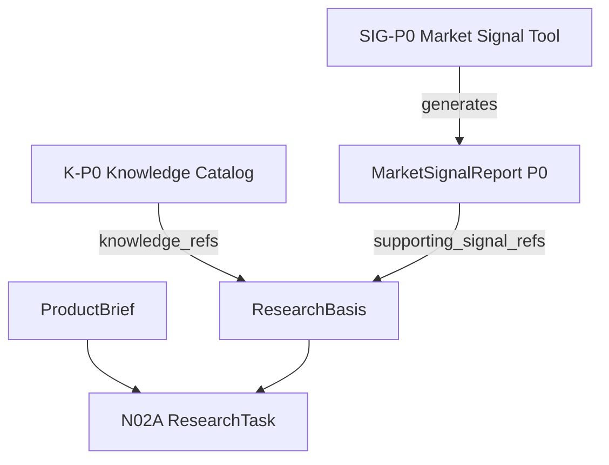

# Parallel Development Tracks

- Version: V0.1
- Status: Draft Architecture Document
- Scope: Three-track development coordination

## 1. 文档职责

本文档说明 video-direction-workbench 为什么分成三条线并行开发，以及三条线之间如何保持接口清晰、职责隔离和提交纪律。

## 2. 三轨总览表

| Track | 名称 | 目标 | 输出 | 不做什么 |
|---|---|---|---|---|
| Track A | N02A ResearchTask Domain Contract | 用 ProductBrief 创建一轮内容研究任务合同 | `ResearchTask` | 不采集市场数据，不生成 SearchPlan，不生成创意方向或脚本 |
| Track B | K-P0 Knowledge Catalog | 建立版本化知识库目录和稳定知识 ID | knowledge_refs / Knowledge Catalog files | 不替代 ProductBrief，不自动学习，不自动覆盖正式知识库 |
| Track C | SIG-P0 Market Signal Tool | 生成市场内容信号报告，服务日常运营判断 | `MarketSignalReport P0` | 不自动修改 ResearchTask，不证明真实购买人群或转化率 |

## 3. Track A: N02A

目标：实现 `ResearchTask` Domain Contract，在 `ProductBrief` 商品事实边界下定义一轮 TikTok 内容研究任务。

输入：

- `ProductBrief`
- 人工运营判断
- K-P0 的 `knowledge_refs`
- SIG-P0 的 `MarketSignalReport P0` 引用

输出：

- `ResearchTask`
- `ResearchBasis`
- `ProductBriefReference`

不做什么：

- Scrape Creators API
- 市场数据采集
- 统计分析
- 自动推荐
- SearchPlan
- 视频抓取
- 视频分析
- 创意方向
- 脚本

当前最小验证：

- 加载 `sample_data/products/car_vacuum_yd_592c.product_brief.json`
- 创建 TikTok US ResearchTask
- 验证 ProductBriefReference 与 ProductBrief 一致
- 验证 ResearchBasis 包含 `basis_type`、`summary`、`knowledge_refs`、`supporting_signal_refs` 和 `limitations`
- 验证创建 ResearchTask 不改变 ProductBrief 内容数量

## 4. Track B: K-P0

目标：建立 K01-K04 的知识库目录、标签体系、稳定 ID 和版本规则。

覆盖：

- K01 Research Lens Catalog
- K02 Platform & Content Rules Library
- K03 Creative Operator Library
- K04 Success / Failure Case Library

输出：

- Knowledge Catalog files
- `knowledge_refs`
- 标签和解释口径

不做什么：

- 数据库
- UI
- 自动学习
- 自动覆盖正式知识库
- 自动生成创意脚本
- 替代 ProductBrief 商品事实边界

## 5. Track C: SIG-P0

目标：做一个可服务日常运营的市场内容信号工具，优先支持 Scrape Creators 或其导出数据。

覆盖：

- 当前覆盖 L1 Content Supply Signals
- 当前覆盖 L2 Content Performance Signals
- 预留 L3 Commercial Conversion Signals
- 预留 L4 Own Business Validation Signals

输出：

- raw data path
- normalized data path
- `MarketSignalReport P0`

不做什么：

- 自动修改 ResearchTask
- 自动批准 audience/scenario/lens
- 自动生成正式 SearchPlan
- 自动生成创意方向或脚本
- 正式 UI
- 正式产品化 CLI
- 数据库
- 将公开视频数据解释为真实购买人群或真实转化结论

## 6. 三轨交互图

## 7. 开发顺序建议

1. Track A 可先实现 `ResearchTask` 合同对象。
2. Track B 可并行定义 `knowledge_ref` 和 K01-K04 最小字段。
3. Track C 可并行实现 SIG-P0 smoke tool。
4. 三轨完成后通过 `ResearchBasis` 做最小集成验证。

## 8. 分支 / 提交纪律

- N02A、K-P0 和 SIG-P0 三条线可以并行。
- N02A、K-P0 和 SIG-P0 必须分别评审、分别测试、分别提交。
- 不得在 N02A 里实现 SIG-P0。
- 不得在 SIG-P0 里自动修改 ResearchTask。
- 不得让 K-P0 或 MarketSignalReport 替代 ProductBrief 的商品事实边界。
