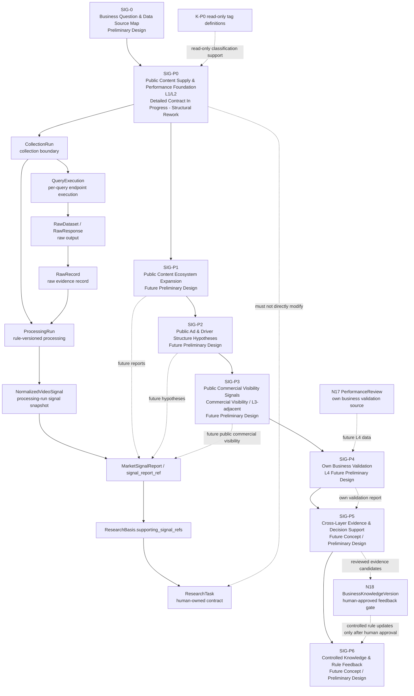

# SIG System Blueprint

- Version: V0.1
- Status: Approved
- Authority: Preliminary Design
- Scope: Whole SIG Market & Business Signal System blueprint from SIG-0 to SIG-P6.
- Depends On: `docs/00_BUSINESS_FLOW.md`, `docs/01_NODE_CONTRACTS.md`, `docs/05_MARKET_SIGNAL_TOOL_CONTRACT.md`, `docs/06_CROSS_TRACK_MESSAGE_CONTRACTS.md`
- Supersedes: None
- Last Updated: 2026-08-07
- Approved By: Andy
- Approval Date: 2026-08-07

Approval Boundary: This approval covers the SIG-0 to SIG-P6 architecture framework only. It does not approve Scrape Creators real fields, parameters, pricing, pagination, ranking, metric semantics, SIG-P0 Implementation Ready status, code implementation, or endpoint suitability.

## System Flow

## Maturity Scale

| Maturity | Meaning |
|---|---|
| Concept | Direction exists, but objects and contract are not stable. |
| Preliminary Design | Business role and boundaries are drafted for review. |
| Detailed Contract | Inputs, objects, outputs, and rules are being specified. |
| Implementation Ready | Approved enough to implement the current slice. |
| Implemented | Code or operational workflow exists. |
| Validated | Verified with accepted data and human review. |

## SIG-0: Business Question & Data Source Map

| Field | Content |
|---|---|
| Stage Purpose | Map business questions to evidence needs, signal layers, candidate data sources, answerability, and interpretation limits. |
| Business Questions | What can public content data answer? Which questions require own business data? Which conclusions are prohibited from public data alone? |
| Candidate Data Sources | Existing business documents, Scrape Creators endpoint names, future own account data, future commerce visibility data. |
| Candidate Core Objects | `BusinessQuestion`, `EvidenceNeed`, `SignalLayer`, `CandidateDataSource`, `AllowedStatement`, `ProhibitedOverclaim`. |
| Main Processing | Classify questions by evidence layer and stage; mark current answerability and required minimum evidence. |
| Standard Outputs | Business question and evidence matrix. |
| What It Can Support | Scope planning, review order, P0/P1/P2/P3/P4 separation, overclaim prevention. |
| What It Cannot Prove | It does not validate endpoint fields, data quality, metrics, or commercial outcomes. |
| Dependencies | Level 1 business sources and Level 2 architecture contracts. |
| Entry Criteria | Need to design SIG without losing future stages. |
| Exit Criteria | Questions are mapped to layers, data source candidates, allowed statements, and prohibited overclaims. |
| Current Maturity | Preliminary Design. |

## SIG-P0: Public Content Supply & Performance Foundation

| Field | Content |
|---|---|
| Stage Purpose | Build the foundation for public video content supply and performance signals. |
| Business Questions | How many relevant public videos appear in the sample? Which queries find valid samples? Which scenes, pain points, and content forms appear often? Which videos perform relatively higher inside the sample? |
| Candidate Data Sources | Scrape Creators JSON / CSV exports first; API adapter later; candidate endpoints include Search by Keyword, Search by Hashtag, Video Info, and Transcript. |
| Candidate Core Objects | `CollectionRun`, `QueryExecution`, `RawDataset`, `RawRecord`, `ProcessingRun`, `PlatformVideoIdentity`, `NormalizedVideoSignal`, `MarketSignalReport P0`, `signal_report_ref`. |
| Main Processing | Record query execution, retain raw data, process existing raw datasets under explicit rule versions, normalize records, merge same-run duplicate video hits, preserve query overlap, classify with read-only K-P0 tags, calculate L1/L2 descriptive statistics. |
| Standard Outputs | Raw data path, normalized data path, `MarketSignalReport P0`, limitations, and report reference. |
| What It Can Support | `ResearchBasis`, audience and scenario hypotheses, pain point hypotheses, content form observations, N03 search strategy support. |
| What It Cannot Prove | Real buying audience, real conversion rate, GMV attribution, ad causality, or guaranteed creative success. |
| Dependencies | `docs/05_MARKET_SIGNAL_TOOL_CONTRACT.md`, `docs/06_CROSS_TRACK_MESSAGE_CONTRACTS.md`, data source reconnaissance, Andy review. |
| Entry Criteria | Approved P0 contract decisions and verified sample export or payload. |
| Exit Criteria | P0 report can be traced to raw records, query conditions, metrics snapshot semantics, and limitations. |
| Current Maturity | Detailed Contract In Progress - Structural Rework. |

## SIG-P1: Public Content Ecosystem Expansion

| Field | Content |
|---|---|
| Stage Purpose | Expand from videos to creator, comment, search expression, trend, and ecosystem observations while staying mainly in L1/L2. |
| Business Questions | Is content concentrated in a few creators? Do high-performing samples mainly come from large accounts? What concerns appear in comments? How do users express related search demand? |
| Candidate Data Sources | Profile, Profile Videos, Comments, Comment Replies, Search Suggestions, Top Search, Trending Feed, Get popular creators. |
| Candidate Core Objects | `CreatorSignal`, `CommentSignal`, `SearchExpressionSignal`, `TrendSignal`, `EcosystemSignalReport`. |
| Main Processing | Group by creator, compare creator size bands, summarize comment themes, preserve public search expression signals. |
| Standard Outputs | Ecosystem expansion report and supporting refs. |
| What It Can Support | Better research scope selection, broader query design, comment-based concern discovery. |
| What It Cannot Prove | True customer demographics, purchase intent, or causal performance drivers. |
| Dependencies | SIG-P0 raw and normalized identity rules; endpoint verification. |
| Entry Criteria | P0 stable enough to reference videos and runs. |
| Exit Criteria | Creator/comment/search/trend signals are separated from P0 core video statistics. |
| Current Maturity | Preliminary Design; future stage. |

## SIG-P2: Public Ad & Driver Structure Hypotheses

| Field | Content |
|---|---|
| Stage Purpose | Observe public ad materials and separate brand, creator, and ordinary user content structures as hypotheses. |
| Business Questions | Are there many public ad materials? Do ads express different claims than organic videos? Are brand, creator, and ordinary-user supply structures different? |
| Candidate Data Sources | TikTok Ad Library Search, Ad Library Ad, public brand videos, public creator videos. |
| Candidate Core Objects | `PublicAdSignal`, `ContentSourceTypeHypothesis`, `DriverStructureHypothesis`. |
| Main Processing | Compare public ad content forms with organic public content and record driver hypotheses. |
| Standard Outputs | Public ad and driver structure hypothesis report. |
| What It Can Support | Hypothesis generation for future research and experiment planning. |
| What It Cannot Prove | True ad spend, real attribution, real GMV driver, or causal channel effect. |
| Dependencies | Endpoint verification, source type classification rules, human review. |
| Entry Criteria | Clear separation between public ad visibility and real advertising performance. |
| Exit Criteria | Driver statements remain hypotheses with limitations. |
| Current Maturity | Preliminary Design; future stage. |

## SIG-P3: Public Commercial Visibility Signals

| Field | Content |
|---|---|
| Stage Purpose | Collect public commercial visibility signals from shop, product, review, and showcase surfaces. |
| Signal Layer | Commercial Visibility - L3-adjacent, not verified L3 conversion evidence. |
| Business Questions | Which related public products and shops are visible? Are products linked to videos in public surfaces? What concerns appear in product reviews? |
| Candidate Data Sources | TikTok Shop Search, Shop Products, Product Details, Product Reviews, User Showcase. |
| Candidate Core Objects | `PublicProductSignal`, `ShopSignal`, `ProductReviewSignal`, `ShowcaseSignal`, `CommercialVisibilityReport`. |
| Main Processing | Normalize public product visibility and review themes without claiming hidden sales metrics. |
| Standard Outputs | Public commercial visibility report. |
| What It Can Support | Product comparison hypotheses, review concern discovery, public commerce landscape review. |
| What It Cannot Prove | Real transaction volume, true conversion rate, or private seller performance. |
| Dependencies | TikTok Shop endpoint verification and interpretation rules. |
| Entry Criteria | Public commerce data access and approved field semantics. |
| Exit Criteria | Public commercial visibility is clearly separated from real conversion evidence. |
| Current Maturity | Preliminary Design; future stage. |

SIG-P3 当前只描述公开商业可见性。它是 L3 Commercial Conversion Signals 的前置信号或邻近信号，不自动进入正式 L3 Commercial Conversion Evidence。只有接口真实返回且已验证点击、加购、成交、销量、广告转化等指标语义后，相关字段才可升级为正式 L3。

## SIG-P4: Own Business Validation

| Field | Content |
|---|---|
| Stage Purpose | Use own account and business data to validate whether market signals transfer to Andy's business context. |
| Business Questions | Did own videos generate views, watch, clicks, add-to-cart, purchases, and useful comments? Is failure caused by direction, Hook, execution, product, or platform mismatch? |
| Candidate Data Sources | N17 `PerformanceReview`, own account analytics, click data, add-to-cart, orders, ad spend, comments, human review. |
| Candidate Core Objects | `OwnContentPerformanceSignal`, `OwnConversionSignal`, `ExperimentResult`, `ValidationSignalReport`. |
| Main Processing | Compare own content performance with market hypotheses and separate direction issues from execution issues. |
| Standard Outputs | Own business validation report and review notes. |
| What It Can Support | Experiment learning, future direction choice, N18 update proposals. |
| What It Cannot Prove | Universal market truth or guaranteed repeatability outside the tested context. |
| Dependencies | Published content tracking through N16 and review through N17. |
| Entry Criteria | Own content has been published and N17 review data exists. |
| Exit Criteria | Own validation signals are traceable to published content and review decisions. |
| Current Maturity | Preliminary Design; future stage. |

## SIG-P5: Cross-Layer Evidence & Decision Support

| Field | Content |
|---|---|
| Stage Purpose | Compare L1-L4 evidence, identify agreement, conflict, and next research or experiment candidates. |
| Business Questions | Which public signals were validated by own data? Which public signals conflict with own results? What should be researched or tested next? |
| Candidate Data Sources | SIG-P0 to SIG-P4 reports, N17 reviews, human operating judgment. |
| Candidate Core Objects | `EvidenceComparison`, `ConflictFinding`, `DecisionSupportObservation`, `ExperimentCandidate`. |
| Main Processing | Cross-check public content supply, public performance, public commerce visibility, and own validation. |
| Standard Outputs | Cross-layer evidence report and candidate decisions for human review. |
| What It Can Support | ResearchBasis updates, experiment planning, N18 proposals. |
| What It Cannot Prove | Fully causal attribution or automatic business rules. |
| Dependencies | Multiple prior SIG reports and human review. |
| Entry Criteria | At least two signal layers have comparable evidence. |
| Exit Criteria | Conflicts and confirmations are explicit and do not bypass human gates. |
| Current Maturity | Concept / Preliminary Design; future stage. |

## SIG-P6: Controlled Knowledge & Rule Feedback

| Field | Content |
|---|---|
| Stage Purpose | Feed validated cases, classification rules, signal interpretation rules, and risk notes back through N18 under human approval. |
| Business Questions | Which rules should be updated? Which evidence is strong enough for a case or interpretation rule? Which changes must be rejected or parked? |
| Candidate Data Sources | SIG-P5 evidence, N17 review, N18 manual decision records, K-P0 catalog. |
| Candidate Core Objects | `RuleUpdateProposal`, `SignalInterpretationRuleCandidate`, `CaseUpdateCandidate`, `BusinessKnowledgeVersion`. |
| Main Processing | Prepare update proposals; N18 controls approval, versioning, and official knowledge changes. |
| Standard Outputs | Human-approved or rejected knowledge/rule update records. |
| What It Can Support | Controlled improvement of K-P0 and signal interpretation rules. |
| What It Cannot Prove | It cannot allow automatic learning or model-generated rule replacement. |
| Dependencies | N18 approval process and versioned knowledge catalog discipline. |
| Entry Criteria | Reviewed evidence and explicit update proposal. |
| Exit Criteria | Approved updates produce versioned records; rejected updates remain traceable. |
| Current Maturity | Concept / Preliminary Design; future stage. |

## Current Capability Boundary

Current work creates design documents only. SIG-P0 is the only stage entering detailed contract framework. SIG-P1 through SIG-P6 remain future designs and are not Implementation Ready.
