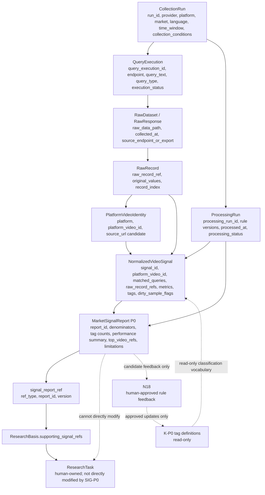
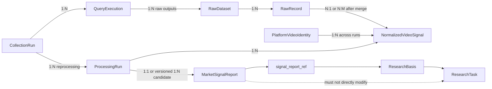

# SIG-P0 Detailed Contract

- Version: V0.1
- Status: Draft
- Authority: Detailed Contract
- Scope: Draft detailed contract framework for SIG-P0 Public Content Supply & Performance Foundation.
- Depends On: [../../01_NODE_CONTRACTS.md](../../01_NODE_CONTRACTS.md), [../../05_MARKET_SIGNAL_TOOL_CONTRACT.md](../../05_MARKET_SIGNAL_TOOL_CONTRACT.md), [../../06_CROSS_TRACK_MESSAGE_CONTRACTS.md](../../06_CROSS_TRACK_MESSAGE_CONTRACTS.md), [00_SIG_SYSTEM_BLUEPRINT.md](00_SIG_SYSTEM_BLUEPRINT.md), [01_BUSINESS_QUESTION_AND_EVIDENCE_MAP.md](01_BUSINESS_QUESTION_AND_EVIDENCE_MAP.md), [02_DATA_SOURCE_CAPABILITY_MAP.md](02_DATA_SOURCE_CAPABILITY_MAP.md)
- Supersedes: None
- Last Updated: 2026-08-06
- Approved By: Pending Andy Review

## 1. Purpose

SIG-P0 creates a reviewable contract for public TikTok content supply and performance signals. It prepares the system to produce `MarketSignalReport P0` without pretending that data source fields, formulas, IDs, or schemas are already frozen.

## 2. Business Problems

- Understand public content supply around selected product, scenario, pain point, and content form queries.
- Observe public performance signals inside a bounded sample.
- Preserve sample limitations and prevent overclaiming.
- Provide `signal_report_ref` evidence support for `ResearchBasis`.

## 3. Current Scope

SIG-P0 covers only:

- L1 Content Supply Signals.
- L2 Content Performance Signals.
- Public video data from verified Scrape Creators JSON / CSV exports first.
- Future API adapter only if it feeds the same canonical raw to normalized pipeline.

## 4. Explicit Non-Goals

- No automatic `ResearchTask` modification.
- No automatic approval of audience, scenario, pain point, or lens.
- No formal `SearchPlan` generation.
- No creative direction or script generation.
- No L3/L4 schema pretending to exist inside P0.
- No database, formal UI, productized CLI, Agent Framework, RAG, or vector database.
- No automatic K-P0 modification or N18 bypass.

## 5. Candidate Inputs

Candidate inputs are not final fields:

- provider
- platform
- market
- language
- time_window
- collection_run_id
- queries
- limit_per_query
- knowledge_catalog_version
- raw export file path
- optional verified endpoint metadata

Provisional Design Decision - Pending Andy Approval: P0 first implementation should prioritize Scrape Creators JSON / CSV export. API adapter is later, and both must share one canonical raw to normalized pipeline.

Candidate Derived Fields are not inputs:

- `matched_queries`

`queries` are the user or operator submitted query conditions for a `CollectionRun`. `QueryExecution` records how each query actually executed. `matched_queries` is the set of queries that actually returned or matched the same video inside that `CollectionRun`; it is a processing result, not an input.

## 6. Data Object Overview

Provisional Design Decision - Pending Andy Approval: SIG-P0 must distinguish:

- `CollectionRun`
- `QueryExecution`
- `RawDataset` / `RawResponse`
- `RawRecord`
- `ProcessingRun`
- `PlatformVideoIdentity`
- `NormalizedVideoSignal`
- `MarketSignalReport`
- `signal_report_ref`



`QueryExecution` and `RawDataset` are not duplicate objects. `QueryExecution` records the execution of one query against one endpoint inside a `CollectionRun`; `RawDataset` / `RawResponse` stores the raw output produced by that execution or import.

### QueryExecution Candidate Semantics

Candidate fields are design notes and do not freeze a Schema:

- query_execution_id
- collection_run_id
- endpoint
- query_text
- query_type
- requested_limit
- retrieved_raw_count
- execution_status
- executed_at
- error_or_limitation
- raw_record_refs

Candidate `execution_status` values:

- succeeded
- partially_succeeded
- failed
- skipped

Draft Contract semantics:

- One `CollectionRun` can contain multiple `QueryExecution` records.
- The same `query_text` executed through different endpoints should be different `QueryExecution` records.
- `retrieved_raw_count = 0` does not equal `failed`.
- `QueryExecution` records collection action and execution outcome; it does not perform final video classification.
- `QueryExecution` does not replace `RawRecord`.

### ProcessingRun Candidate Semantics

Candidate fields are design notes and do not freeze a Schema:

- processing_run_id
- source_collection_run_id
- raw_dataset_refs
- normalization_version
- deduplication_policy_version
- classification_rule_version
- statistics_definition_version
- processed_at
- processing_status
- processing_limitations

Candidate `processing_status` values:

- succeeded
- partially_succeeded
- failed

Draft Contract semantics:

- `CollectionRun` records what was collected or imported.
- `ProcessingRun` records which explicit normalization, deduplication, classification, and statistics rule versions were applied to already collected data.
- The same `CollectionRun` can have multiple `ProcessingRun` records.
- `NormalizedVideoSignal` must bind to a specific `ProcessingRun`.
- `MarketSignalReport` must bind to a specific `ProcessingRun`.
- Reprocessing raw data must not overwrite old `ProcessingRun` outputs.
- `ProcessingRun` is not an Agent, workflow framework, database job, async task system, or CLI command.

### Draft Contract Relationship And Cardinality

The following diagram is a draft contract relationship, not an implemented database relationship:



Relationship explanation:

1. `CollectionRun` is the collection boundary.
2. `QueryExecution` is the per-query execution granularity.
3. `RawDataset` / `RawRecord` is the raw evidence layer.
4. `ProcessingRun` is the rule version and reprocessing boundary.
5. `PlatformVideoIdentity` is the video entity identity.
6. `NormalizedVideoSignal` is a video signal snapshot inside one `ProcessingRun`.
7. `MarketSignalReport` binds to a specific `ProcessingRun`.
8. `ResearchTask` only references reports through `signal_report_ref`; Track C must not modify it.

## 7. Data Granularity & Identity

Provisional Design Decision - Pending Andy Approval:

- `CollectionRun` represents one execution or import event.
- The same query conditions executed again create a new `CollectionRun`.
- Old runs must not be overwritten.
- `QueryExecution` represents one concrete query condition executed against one endpoint within a `CollectionRun`.
- `RawRecord` represents one source-returned row or JSON object.
- `ProcessingRun` represents one processing pass over one or more existing raw datasets with explicit rule versions.
- `platform_video_id` represents platform video identity.
- `signal_id` represents a normalized signal snapshot for one video inside one `ProcessingRun`.
- The same video across different runs can produce different `signal_id` values.
- Cross-run metric snapshots must not be overwritten just because `platform_video_id` is the same.

## 8. Raw Data Retention

Raw layer principles:

- Raw records are not physically deleted because they are duplicates.
- Raw values are not silently changed.
- Later processing may mark, reference, exclude, or merge raw records.
- `NormalizedVideoSignal` must trace back to one or more `raw_record_refs`.
- `raw_data_path` alone is not sufficient for record-level traceability.

## 9. Normalization Boundary

Normalization converts verified raw fields into canonical SIG-P0 values. It must not infer product facts, purchase facts, conversion facts, or creator intent.

Candidate normalized areas:

- video identity
- source URL
- matched queries
- publication and collection times
- public metrics
- caption, hashtags, transcript if available
- product link presence as public visibility only
- classification candidates
- dirty sample flags
- raw record refs

`queries`, `QueryExecution`, and `matched_queries` must remain distinct:

- `queries` are configured collection inputs.
- `QueryExecution` records each query's endpoint, status, timing, raw count, and limitations.
- `matched_queries` is derived from raw records and normalization after a video is found by one or more queries.
- Query text cannot automatically become a video tag.
- When the same video is hit by multiple queries, `matched_queries` preserves all hit relationships.

## 10. Deduplication Policy

Provisional Design Decision - Pending Andy Approval:

- `exact_raw_duplicate`: identical raw records or repeated rows.
- `duplicate_across_queries`: same platform video hit by multiple queries in the same run.
- `duplicate_across_runs`: same platform video observed in different runs.
- `possible_repost`: similar or copied content that may not be the same platform video.

Initial rules:

- Same run and same platform video: merge into one `NormalizedVideoSignal`.
- Same video across different runs: keep different snapshots.
- `possible_repost`: P0 does not auto-merge; it may only mark.
- Query overlap is not only dirty data; it is also a content retrieval coverage signal.

## 11. Missing / Invalid / Dirty Data

- Missing metrics must not default to 0.
- `0` and `null` have different business meanings.
- Invalid records and excluded samples require separate definitions.
- Dirty sample flags must preserve reasons instead of hiding bad data.
- P0 must later define metric snapshot time and metric coverage.

## 12. Classification Boundary

Provisional Design Decision - Pending Andy Approval:

- SIG-P0 may read K-P0 tag definitions.
- SIG-P0 must not modify K-P0.
- Classification must allow `unclassified` and `uncertain`.
- Query terms must not automatically become video tags.
- Future P0 implementation must preserve classification basis, rule version, and evidence.
- This round does not freeze the tag taxonomy.

## 13. L1 Statistics

Candidate L1 outputs:

- raw record count
- valid raw record count
- deduped video count
- duplicate count by duplicate category
- matched query coverage
- scenario tag counts
- audience context counts
- pain point counts
- content type counts
- product reference type counts
- dirty sample notes

Formulas and thresholds remain open decisions.

## 14. L2 Statistics

Candidate L2 outputs:

- valid metric sample counts
- view, like, comment, and share distributions
- engagement rate candidates if fields are verified
- median and percentile summaries
- top video refs
- metric missingness notes
- age-band comparison candidates if `published_at` is verified

Statistics must record different denominators, including before cleaning, after cleaning, and after deduplication. Median and percentiles are preferred over average-only summaries. Tag performance comparison must keep valid sample size.

## 15. Evidence Observation Format

Candidate observation structure remains open, but each observation should preserve:

- observation_id
- related signal layer
- statement
- supporting signal refs
- sample denominator
- metric snapshot assumptions
- limitations
- prohibited overclaim

Observation format is not frozen in this round.

## 16. MarketSignalReport P0

The current Level 2 contract lists candidate `MarketSignalReport P0` fields. This detailed contract keeps that direction and adds review needs:

- report identity and version rule
- source run references
- raw and normalized paths
- signal layers covered, limited to L1/L2
- source queries and matched query coverage
- denominators
- distribution summaries
- top video refs
- dirty sample notes
- `research_basis_evidence_summary`
- limitations

The report can only be referenced by `ResearchBasis` through `signal_report_ref`. It cannot be copied wholesale into `ResearchTask`.

`research_basis_evidence_summary` can only summarize:

- what the current sample observed
- how many valid samples support the observation
- which videos or signal refs support the observation
- what limitations apply
- which questions deserve further human research

It cannot directly output:

- which `primary_audience` should be selected
- which `use_scenario` should be approved
- which `pain_point` should be approved
- which lens should be selected
- an automatic `ResearchTask`
- a formal `SearchPlan`

Forbidden example:

```text
建议将宠物主人设置为 primary_audience。
```

Allowed example:

```text
当前样本中 pet_hair_context 出现频率较高，但不能证明宠物主人是真实主要购买人群；可由人工决定是否作为后续研究假设。
```

## 17. Interpretation Rules

Provisional Design Decision - Pending Andy Approval:

- `MarketSignalReport` outputs descriptive market content signals only.
- It cannot prove real buying audience.
- It cannot prove real conversion rate.
- It cannot prove real ad, creator, organic traffic, or GMV attribution.
- It cannot prove a creative will succeed.
- Correlation must not be expressed as causation.
- `product_link_present` is only public link presence, not proof of clicks or purchases.

## 18. Cross-Track References

- Track C produces `MarketSignalReport P0` and `signal_report_ref`.
- Track A may reference `signal_report_ref` inside `ResearchBasis.supporting_signal_refs`.
- Track B may provide read-only K-P0 tag definitions.
- N18 controls official rule and knowledge feedback with human approval.

## 19. Entry / Exit Criteria

Entry criteria before implementation:

- Andy reviews the system blueprint.
- Andy reviews business question and evidence boundaries.
- P0 core endpoint reconnaissance has sample payloads or verified exports.
- Open decisions required for a minimal implementation are resolved.

Exit criteria for P0 contract readiness:

- Data source fields and limitations are verified.
- Identity and traceability rules are approved.
- Raw, normalized, and report objects are sufficiently specified.
- Statistics and interpretation rules are approved.
- Non-goals and cross-track boundaries remain explicit.

## 20. Open Decisions

- Scrape Creators four P0 core endpoint real fields and limits.
- Handling when `platform_video_id` is missing.
- Whether `source_url` can be used as fallback dedupe key.
- Stable format for `raw_record_ref`.
- Stable generation rule for `signal_id`.
- Stable format for `query_execution_id`.
- Stable generation rule for `processing_run_id`.
- Definition of `metric_snapshot_at`.
- Field conflict merge rules.
- Difference between invalid record and excluded sample.
- Structure of `dirty_sample_flags`.
- Structure of classification results.
- Basic statistics formulas.
- Minimum sample thresholds.
- `MarketSignalReport` observation structure.
- `report_id` and version rules.
- Raw and normalized artifact path conventions.
- Exact relationship between `QueryExecution` and `RawDataset`.
- Cardinality between `ProcessingRun` and `MarketSignalReport`.

## 21. Deferred Design

- SIG-P1 creator, comment, search expression, and trend expansion.
- SIG-P2 public ad and driver structure hypotheses.
- SIG-P3 public commercial visibility.
- SIG-P4 own business validation.
- SIG-P5 cross-layer evidence support.
- SIG-P6 controlled knowledge and rule feedback.
- API adapter implementation.
- Database, UI, formal CLI, orchestration, and automation.

## 22. Change Discipline

- This document is Draft and not approved.
- SIG-P0 fields are not frozen in this round.
- Provisional decisions remain pending Andy approval.
- Lower-level implementation must not redefine Level 1 or Level 2 contracts.
- Any conflict with higher authority documents must stop affected work for human decision.
- No SIG business code should be written before the contract review is approved.
