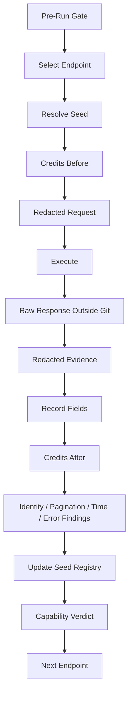

# Scrape Creators Runtime Reconnaissance Execution Plan

- Version: V0.1
- Status: Approved
- Track: Track C — SIG Market Signal Tool
- Date: 2026-08-07
- Approved By: Andy
- Approval Date: 2026-08-07
- Authority: Runtime Execution Plan
- Scope: Execution order, test depth, seed strategy, validation questions, completion criteria, and governance gates for the 29-endpoint Scrape Creators runtime reconnaissance campaign.
- Depends On: [04_SCRAPE_CREATORS_RECONNAISSANCE_PLAN.md](04_SCRAPE_CREATORS_RECONNAISSANCE_PLAN.md), [05_SCRAPE_CREATORS_ENDPOINT_TEST_MATRIX.md](05_SCRAPE_CREATORS_ENDPOINT_TEST_MATRIX.md), [06_SCRAPE_CREATORS_RESULT_RECORDING_CONTRACT.md](06_SCRAPE_CREATORS_RESULT_RECORDING_CONTRACT.md), [07_SCRAPE_CREATORS_RECONNAISSANCE_REPORT.md](07_SCRAPE_CREATORS_RECONNAISSANCE_REPORT.md), [08_SCRAPE_CREATORS_REQUEST_SURFACE_BASELINE.md](08_SCRAPE_CREATORS_REQUEST_SURFACE_BASELINE.md)
- Supersedes: None
- Last Updated: 2026-08-07

## Purpose And Boundary

[08_SCRAPE_CREATORS_REQUEST_SURFACE_BASELINE.md](08_SCRAPE_CREATORS_REQUEST_SURFACE_BASELINE.md) records provider request-side observed facts: endpoint routes, UI descriptions, visible parameters, required markers, selected enum observations, explicit provider notes, and explicit UI cost notes.

This document defines how the later runtime campaign must execute the 29 endpoint tests:

- in what order;
- at what test depth;
- with what seed strategy;
- what each endpoint must verify;
- how completion is judged.

This document does not execute the campaign. It does not call any API, approve any budget, create code, finalize schemas, or change archived baseline documents.

## 1. Campaign Objective

The runtime campaign is not a "check whether HTTP 200 returns" exercise. HTTP or tool success is only one piece of evidence.

Each endpoint must ultimately answer:

- how it can be legally called;
- what it actually returns;
- what stable identity exists;
- whether its output can link to other endpoints;
- how pagination works;
- what time, freshness, and snapshot semantics exist;
- how null, missing, zero, empty, dirty, blocked, and error cases are represented;
- what credits, quota, rate limits, and access gates are observable;
- which business evidence the endpoint can support;
- what the endpoint cannot prove;
- what final Capability Verdict applies.

Allowed final Capability Verdict values are:

- Adopt For P0
- Adopt For Future Stage
- Research Only
- Reject
- Blocked Pending Access

## 2. Dependency Waves

The campaign should execute in dependency waves so later tests use real runtime seeds instead of invented IDs. Wave order does not reduce scope. Completion still requires 29 / 29 endpoints to have conclusions.

### Wave A — Seed Discovery

Endpoints:

- TT-17 Search by Keyword
- TT-16 Search by Hashtag
- TT-18 Top Search
- TT-14 Search Users
- SHOP-01 Shop Search
- AD-01 Ad Library Search

Objective:

First obtain real video, creator, shop, product, ad, song, comment, and live-candidate seeds needed by later endpoint tests.

Primary outputs:

- candidate video identities or URLs;
- candidate creator identities or handles;
- candidate shop identities;
- candidate product identities when available;
- candidate ad identities;
- observed pagination and duplicate behavior for search surfaces;
- seed-quality notes for later waves.

### Wave B — Core Entity Verification

Endpoints:

- TT-06 Video Info
- TT-01 Profile
- TT-02 Profile Region
- TT-05 Profile Videos
- TT-07 Transcript
- TT-10 Comments

Focus:

- Video
- Creator
- Transcript
- Comment
- identity linkage among them

Primary verification questions:

- Does TT-06 confirm the same video identity found by search?
- Does TT-06 expose a creator identity usable by TT-01 and TT-05?
- Does TT-07 accept the same video identity or require a different format?
- Does TT-10 accept the same video identity and expose stable comment identities?
- Does TT-02 produce a profile-region signal linked to the same creator identity?

### Wave C — Relationship Data

Endpoints:

- TT-11 Comment Replies
- TT-12 Following
- TT-13 Followers
- TT-04 Collection Videos
- TT-20 Get Song Details
- TT-21 TikToks using Song
- TT-03 User's Audience Demographics

Focus:

- comment-to-reply relationships;
- creator social graph exposure and limits;
- collection-to-video relationships;
- song-to-video relationships;
- demographic estimate availability and boundary.

### Wave D — Volatile / Trend / Live

Endpoints:

- TT-08 Live
- TT-09 Live Info
- TT-15 Search Suggestions
- TT-19 Get Popular Creators
- TT-22 Trending Feed

Focus:

- live availability and live identity;
- trend and ranking volatility;
- market or region effects when supported;
- repeated snapshot behavior when approved by the Budget Gate.

### Wave E — Shop + Ads Deep Verification

Shop sequence:

SHOP-01 Shop Search
-> SHOP-02 Shop Products
-> SHOP-03 Product Details
-> SHOP-04 Product Reviews

Additional shop endpoint:

- SHOP-05 User Showcase

Ads sequence:

AD-01 Ad Library Search
-> AD-02 Ad Library Ad

SHOP-01 and AD-01 appear in Wave A for seed discovery. They return in Wave E for deeper verification of request behavior, response fields, pagination, identity linkage, and business interpretation boundaries.

## 3. Test Depth

Runtime testing uses differentiated depth. All endpoints must complete Level 1. Only endpoints likely to support SIG adoption or high-risk interpretation need deeper verification.

### Level 1 — Capability Proof

Coverage:

- 29 / 29 endpoints.

Minimum requirement:

- successful call or evidence-backed blocked status;
- basic input behavior;
- basic response shape;
- identity conclusion;
- business use;
- interpretation boundary;
- Capability Verdict.

Level 1 can end in `Blocked Pending Access` when access, quota, prerequisite, plan, safe legal input, or budget gate prevents a success case and the block is evidence-backed.

### Level 2 — Contract Verification

Coverage:

Endpoints that may be adopted by SIG-P0 or a later SIG stage.

Verify:

- required and optional parameters;
- legal parameter combinations;
- pagination and coverage;
- identity stability;
- time and snapshot semantics;
- missingness;
- error representations;
- region or market behavior;
- credits, quota, and access boundaries;
- trim, cache, or equivalent provider behavior when exposed by 08.

Level 2 cannot be completed by endpoint names or UI labels alone. It requires runtime evidence, explicit provider documentation, or evidence-backed blocked conclusions.

### Level 3 — Behavior Verification

Default candidates:

- TT-16 Search by Hashtag
- TT-17 Search by Keyword
- TT-18 Top Search
- TT-06 Video Info
- TT-08 Live
- TT-09 Live Info
- TT-22 Trending Feed

Verify, only within approved budget and stop limits:

- repeated requests;
- ranking changes;
- metric changes;
- region effect;
- filter effect;
- volatility.

Level 3 is not a full market study. It only verifies whether endpoint behavior is stable enough to interpret safely.

## 4. Seed Registry

The campaign must maintain a shared Seed Registry. Runtime tests must not invent seeds, assume identifiers, or fabricate unavailable objects.

Initial seed slots:

- seed_creator_01
- seed_video_01
- seed_video_with_transcript
- seed_video_without_transcript
- seed_video_with_comments
- seed_comment_with_replies
- seed_song_01
- seed_shop_01
- seed_product_01
- seed_product_with_reviews
- seed_ad_01
- seed_live_01

Each seed record must include at least:

| field | purpose |
|---|---|
| seed_id | Internal campaign seed identifier. |
| seed_type | Creator, video, comment, song, shop, product, ad, live, or other approved type. |
| source_endpoint | Endpoint that discovered or confirmed the seed. |
| external_id_or_url | Provider/platform ID, URL, handle, or other non-secret locator. |
| provider_identity | Observed stable provider identity fields. |
| why_selected | Why this seed is useful for later tests. |
| observed_at | Runtime observation timestamp. |
| usable_for_endpoints | Endpoint IDs this seed can support. |
| notes | Limitations, privacy/safety notes, or unresolved questions. |

Seed use rules:

- A seed can be `Candidate` before confirmation.
- A seed becomes `Confirmed` only after runtime response evidence supports its identity.
- A seed that becomes unavailable remains in the registry with status and evidence.
- Raw evidence must not be altered to remove duplicate or failed seed cases.

## 5. Fixed Search Query Seeds

The campaign may use these fixed search query seeds only for API reconnaissance:

| query | role |
|---|---|
| car vacuum | product |
| car cleaning | category |
| seat gap cleaning | scenario |
| pet hair car | pain-point |

These queries are not formal market research. They only provide stable, reviewable search inputs for runtime API capability testing.

## 6. Region Strategy

Primary region:

- US

Only endpoints where region has business or request-surface meaning should receive a second-region test.

Second-region rules:

- The value must be a provider-allowed value observed at runtime, observed in 08, or documented by provider evidence.
- The second region exists only to test whether region parameters change behavior.
- The campaign must not expand into global market research.
- If a region parameter is exposed but cannot be tested inside the Budget Gate, record `Explicit Unknown` with reason.

## 7. Standard 8 Result Blocks

Each endpoint's final runtime findings must use these eight result blocks.

### 1. Request Contract

Record:

- endpoint path and version used;
- method or tool action;
- accepted input identity type;
- required and optional parameters;
- legal and rejected combinations;
- cache, trim, region, cursor, or sort options;
- redacted request evidence path.

### 2. Response Contract

Record:

- top-level response shape;
- record count;
- important field paths;
- observed types;
- missing and nullable fields;
- response hash or protected raw evidence reference;
- redacted response evidence path.

### 3. Identity & Linkage

Record:

- stable identity fields;
- URL or handle fallback behavior;
- cross-endpoint equivalent fields;
- linkable and non-linkable identities;
- linkage confidence and evidence.

### 4. Pagination & Coverage

Record:

- whether pagination exists;
- cursor or page token field;
- first page behavior;
- next page behavior;
- end page behavior;
- duplicate observations;
- maximum observed count and unknown hard limits.

### 5. Time & Snapshot

Record:

- publish time fields;
- collected or observed time;
- update time or freshness fields;
- timezone if visible;
- repeated snapshot results when required and approved;
- whether snapshot semantics remain unknown.

### 6. Dirty / Error Semantics

Record:

- null, missing, zero, empty string, and absent nested objects;
- no-result behavior;
- invalid object behavior;
- unavailable object behavior;
- no transcript, no comments, non-live, and restricted cases where relevant;
- error code, message, retryability, and account-risk notes.

### 7. Cost & Access

Record:

- provider UI explicit cost when known;
- runtime observed credit delta when visible;
- plan gates;
- quota signals;
- rate-limit signals;
- access blocks;
- whether cost remains Explicit Unknown.

### 8. Business Verdict

Record:

- supported business evidence;
- unsupported or prohibited interpretations;
- candidate SIG stage;
- final Capability Verdict.

Business Verdict must use only:

- Adopt For P0
- Adopt For Future Stage
- Research Only
- Reject
- Blocked Pending Access

## 8. Credit Observation

Credit evidence must distinguish provider UI explicit cost from runtime observed credit delta.

Known UI facts from 08:

| endpoint_id | UI explicit cost | source |
|---|---|---|
| TT-03 | 26 credits/request | Observed From UI |
| SHOP-02 | 1 credit/request | Observed From UI |

Runtime credit observation, when visible, must record:

- credits_before
- credits_after
- observed_credit_delta
- credit_delta_status

Allowed `credit_delta_status` values:

- Observed
- Not Visible
- Conflicting
- Not Applicable
- Blocked

A single runtime observed delta must not be promoted into permanent provider pricing.

## 9. Negative Testing

Negative testing is limited to business-necessary cases:

- empty required input;
- no-result query;
- invalid or nonexistent object;
- no transcript;
- no comments;
- non-live creator.

Do not run:

- fuzzing;
- injection;
- large volumes of junk strings;
- provider QA;
- destructive or account-risk tests.

Negative tests must be low-volume, legally safe, and within the approved Budget Gate.

## 10. Duplicate / Pagination

Priority duplicate and pagination endpoints:

- TT-16 Search by Hashtag
- TT-17 Search by Keyword
- TT-18 Top Search

Observe:

- same-page duplicate;
- cross-page duplicate;
- same video ID;
- same URL;
- repeated request duplicate;
- query overlap.

Raw evidence must not delete duplicates. Duplicates are evidence for provider behavior and later dedupe rules.

## 11. Repeated Snapshot

Repeated snapshot policy:

| requirement | endpoints |
|---|---|
| Required | TT-06, TT-08, TT-09 |
| Not Applicable | TT-02, TT-07 |
| Conditional | All other endpoints unless the matrix is later updated by review. |

Repeated calls are still blocked by the Budget Gate, request caps, page caps, quota threshold, and account-risk rules.

## 12. Cross-Endpoint Identity Map

The campaign must establish a final Cross-Endpoint Identity Map.

### Video Chain

TT-17 / TT-16 / TT-18
-> TT-06
-> TT-07
-> TT-10
-> TT-11

### Creator Chain

TT-14
-> TT-01
-> TT-05
-> TT-12
-> TT-13
-> TT-03

### Song Chain

Video/Search
-> TT-20
-> TT-21

### Shop Chain

SHOP-01
-> SHOP-02
-> SHOP-03
-> SHOP-04

Creator
-> SHOP-05

### Ad Chain

AD-01
-> AD-02

Identity Map records must include at least:

| field | purpose |
|---|---|
| source_endpoint | Endpoint where the source identity was observed. |
| source_field | Field path or parameter used as source. |
| target_endpoint | Endpoint tested with the identity. |
| target_parameter | Target request parameter or identity input. |
| identity_type | Video, creator, comment, song, shop, product, ad, live, or other approved identity type. |
| linkage_status | Confirmed, Partial, Conflicting, Unavailable, or Unknown. |
| evidence | Test run refs or artifact refs. |
| notes | Interpretation notes and remaining unknowns. |

Allowed `linkage_status` values:

- Confirmed
- Partial
- Conflicting
- Unavailable
- Unknown

## 13. Endpoint Completion Criteria

An endpoint is not complete just because it returns 200.

Each endpoint must have:

- Request Contract conclusion;
- Response Contract conclusion or evidence-backed Blocked;
- Identity conclusion;
- Pagination conclusion or Not Applicable;
- Time conclusion or evidence-backed Unknown;
- Dirty / Error conclusion;
- Cost observation or Explicit Unknown;
- Business Boundary recorded;
- Capability Verdict assigned.

If success cannot be obtained, the endpoint can still complete with evidence-backed blocked, unavailable, not applicable, or deferred status only when reason, evidence, remaining unknowns, and legal Capability Verdict mapping are recorded.

## 14. Campaign Completion Criteria

The campaign is complete only when 29 / 29 endpoints have conclusions.

Final outputs must include at least:

- Seed Registry;
- Runtime Request Findings;
- Response Field Observations;
- Pagination Findings;
- Error / Dirty Semantics;
- Credit / Access Observations;
- Runtime Discrepancy Log vs 08;
- Cross-Endpoint Identity Map;
- Capability Verdict Matrix;
- Completed 07 Reconnaissance Report.

No endpoint may remain `Not Run` without an evidence-backed reason. No final Capability Verdict may remain `Pending Test`.

## 15. Runtime Discrepancy vs 08

If runtime evidence conflicts with 08, do not silently modify 08.

Record a discrepancy with:

| field | purpose |
|---|---|
| endpoint_id | Endpoint where the conflict was found. |
| 08_observation | Prior request-side observation from 08. |
| runtime_observation | Runtime finding. |
| discrepancy_type | Route, parameter, enum, required marker, method, auth, cost, response, behavior, or other. |
| runtime_evidence | Test run refs or artifact refs. |
| resolution_status | Pending Review, Accepted Runtime Supersedes, 08 Corrected As Transcription Error, Provider Changed, or Rejected. |

08 remains historical observed evidence unless Andy approves a correction or superseding record.

## 16. Business Boundaries

Runtime findings must preserve these boundaries:

- Public video data cannot prove true buyer identity, true purchasing audience, verified conversion rate, GMV attribution, or guaranteed creative success.
- Audience Demographics cannot prove true buying audience.
- Comments cannot directly prove purchase intent.
- Shop public data cannot prove verified conversion or GMV.
- Ad Library data cannot prove spend, ROAS, or GMV attribution.
- Public performance data cannot guarantee creative success.

These boundaries apply even when an endpoint returns rich fields or successful calls.

## 17. Runtime Flow

This round only defines the flow. It does not execute the flow.

Pre-Run Gate includes budget approval, request/page caps, quota threshold, legal input review, raw evidence path setup, redaction process, and no-secret handling.

## 18. Budget Gate

Runtime Campaign in real execution must close the Budget Gate before any API call.

Current status:

- Budget Gate = Pending Approval

This document does not approve:

- currency budget;
- request budget;
- per-endpoint request cap;
- pagination page cap;
- repeated snapshot cap;
- minimum remaining quota threshold;
- budget exception rule.

If Budget Gate remains Pending, runtime calls must not begin.

## 19. Security

Forbidden in Git documentation and review artifacts:

- real API key;
- raw authenticated request;
- cookies;
- session token;
- secret;
- account-control material.

Raw responses:

- do not enter Git by default;
- are preserved outside Git or in another protected location;
- must be hashed before redaction when retained;
- must pass sensitive-data review before any future Git decision.

Canonical request evidence must be redacted and must not permit recovery of a secret.

## 20. Initial Priority

Priority 1:

- TT-17 Search by Keyword
- TT-06 Video Info
- TT-07 Transcript

Priority 2:

- TT-16 Search by Hashtag
- TT-18 Top Search
- TT-05 Profile Videos
- TT-01 Profile
- TT-10 Comments

Priority 3:

- all remaining endpoints.

Priority guides execution order only. Final campaign completion still requires 29 / 29 endpoint conclusions.

## 21. Endpoint Execution Checklist

Before executing an endpoint:

1. Confirm Budget Gate is approved.
2. Confirm endpoint is listed in the 05 matrix.
3. Confirm request surface is referenced from 08.
4. Confirm seed exists or endpoint belongs in seed discovery.
5. Confirm no secret will be persisted.
6. Confirm raw response storage is outside Git.
7. Confirm redacted evidence path is ready.

After executing an endpoint:

1. Save raw response outside Git.
2. Save redacted evidence for review.
3. Record field observations.
4. Record pagination and duplicate observations.
5. Record time and snapshot findings.
6. Record error and dirty-data findings.
7. Record credit and access findings.
8. Update Seed Registry.
9. Update Cross-Endpoint Identity Map.
10. Assign or defer Capability Verdict according to evidence.

## 22. Non-Goals For This Plan

This execution plan does not:

- approve live testing;
- fill budget values;
- call the Scrape Creators API;
- use an API key;
- start a Campaign;
- write source code;
- define implementation schemas;
- modify SIG-P0 implementation contract;
- modify archive snapshots;
- approve any provisional decision.
